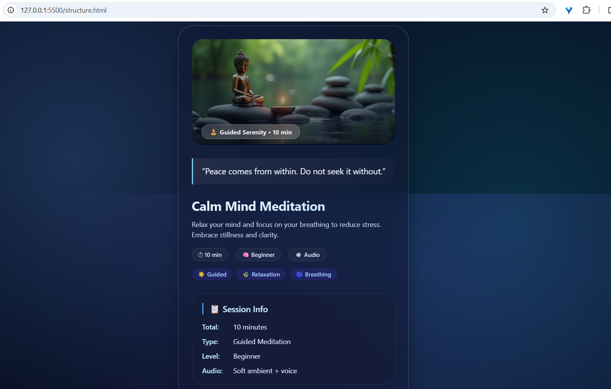

# 🧘 Meditation Session UI Card

A modern, glass‑morphism meditation card UI built with pure HTML & CSS.  
Smooth hover, calm color palette, and **zero white‑strip bug** — even on Chromium.

> *(replace with your actual screenshot or live preview image)*

---

## ✨ Features

- 🪟 Glassmorphic card with `backdrop‑filter` blur
- 🖼️ Hero image with smooth scale‑on‑hover (no bottom gap)
- 🌈 Gradient background + ambient light effect
- 📋 Distinct glass sections: Session Info, Benefits, Meditation Steps
- 🎯 Fully responsive (mobile & desktop)
- 🧹 Clean, modern typography (Inter font)

---

## 🔗 Live Demo

👉 [View Live](https://golu-dhama.github.io/meditation-session-ui-card/)  
*(replace with your actual GitHub Pages link or open `index.html` directly)*

---

## 🛠️ Built With

- HTML5
- CSS3 (Flexbox, Grid, backdrop‑filter, transforms)

---

🙏 Credits
Design & code — Azad Dhama
Inspired by modern meditation apps and calm UI trends.
